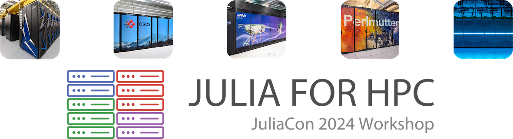

# JuliaCon24 Workshop: Hands-on with Julia for HPC on GPUs and CPUs

 

**Instructors:** [Carsten Bauer](https://github.com/carstenbauer), [Ludovic Räss](https://github.com/luraess), [Ivan Utkin](https://github.com/utkinis), and [Johannes Blaschke](https://github.com/JBlaschke) (remote).

**Where:** TU-Eindhoven 0.244

**When:** July 9th, 1:30 PM (CEST)

**More:** https://pretalx.com/juliacon2024/talk/NTQZJJ/

## Schedule

* **Onboarding**
  * [Introduction](./onboarding/intro.pdf) [~5m]
  * [NERSC overview](./onboarding/overview.pdf) [~10m]
  * [Julia + VS Code on Perlmutter](./onboarding/julia_vscode_on_perlmutter.pdf) [~20m]

* **Introducing the example**
  * [2D linear diffusion solver](./parts/diffusion_2d) [~15m]

* **Parallelization on Perlmutter**
  * [Multithreading](./parts/multithreading) [~40m]

    (short break) [~10m]
  * [MPI parallelization](./parts/mpi) [~40m]
  * [GPU acceleration](./parts/gpu) [~40m]

## Prepare for the workshop

To begin with, make sure that you have [VS Code](https://code.visualstudio.com/download) installed on your laptop.

### VS Code → Perlmutter (via SSH)

1) In VS Code, press `F1` and run the `Remote-SSH: Open SSH Host...` command.
   - If the command isn't available, make sure that [Remote - SSH extension](https://marketplace.visualstudio.com/items?itemName=ms-vscode-remote.remote-ssh) is installed (but it should be available out of the box).
2) Enter `trainXY@perlmutter.nersc.gov` (with `trainXY` replaced by your training account) and press enter.
3) In the popup input box, enter your password and press enter.

After a second or two, you should have VS Code running on a Perlmutter login node! 🎉

### On Perlmutter
1. Clone the workshop materials into `$SCRATCH/juliacon24-hpcworkshop`by running the following command.

       git clone https://github.com/JuliaHPC/juliacon24-hpcworkshop $SCRATCH/juliacon24-hpcworkshop

    * **You will always work in this folder (`$SCRATCH/juliacon24-hpcworkshop`) during the workshop.**
2. Run the following commands:

       cd $SCRATCH/juliacon24-hpcworkshop
       ./setup.sh

    

     
What does this do? (click me if you're curious)

    * The setup script
        * modifies your `$HOME/.bashrc` to
            * permanently put your Julia depot onto the parallel file system (`$SCRATCH/.julia`)
            * auto-load the Julia module when you login (such that the `julia` command is available)
            * make `mpiexecjl` available (i.e. modify `$PATH`)
        * instantiates the Julia environment
        * installs MPI.jl's `mpiexecjl` wrapper
        * installs a Jupyter kernel (for NERSC's Jupyter hub)

    

3. **!! Before you proceed, restart VS Code !!**
    * Close it fully, open it again, and connect to Perlmutter again (see above). Otherwise the `.bashrc` changes won't be in effect.

4. Let's now turn to the Julia VS Code extension.

   1) Installing the extension
      - Open the extensions view (press `CTRL/CMD + SHIFT + X`).
      - Search for `julia`.
      - Click on `install`.
   2) Pointing it to `julia_wrapper.sh`
      - Open the VS Code Settings (press `CTRL/CMD + ,`).
      - Click on the tab `Remote [SSH: perlmutter.nersc.gov]`.
      - Search for `Julia executable`.
      - Insert `/pscratch/sd/t/trainXY/juliacon24-hpcworkshop/julia_wrapper.sh` - with `trainXY` replaced by you training account name - into the text field under `Julia: Executable Path`.
    3) If `ALT/OPTION + J` followed by `ALT/OPTION + O` (**or** pressing `F1` and executing the `Julia: Start REPL` command) successfully spins up the integrated Julia REPL, you know that the setup is working! 🎉

 5. Finally, you should open the workshop directory in VS Code.
     * In the VS Code terminal, run `cd $SCRATCH/juliacon24-hpcworkshop` followed by `code -r .`
     * Manual alternative: Click on the green button "Open Folder" (or press `CTRL/CMD + O`) and enter `/pscratch/sd/t/trainXY/juliacon24-hpcworkshop` - **with `trainXY` replaced by you training account name**.

## Help?

### Cheatsheets

* [Perlmutter cheatsheet](./help/perlmutter_cheatsheet.md)
* [VS Code cheatsheet](./help/vscode_cheatsheet.md)

### VS Code isn't working for me, what should I do?

As a fallback, you can also try to use Jupyter under https://jupyter.nersc.gov. Just make sure to use the `JuliaCon24 HPC Workshop 1.10.4` kernel (open a notebook and select the kernel in the top right corner).

## Applying for NERSC Training Account

To get the most out of the workshop, you need to apply for a NERSC training account **before the workshop (as early as possible)**! The reason for this is that everyone who applies for an account has to be checked, which can take some time (between a few minutes and a week) depending on their personal background (e.g. nationality and affiliation).

**Please only apply for an account if you 1) have a workshop ticket and 2) really plan to participate in the JuliaCon 2024 workshop on Tuesday, July 9 in person!**

### Sign up for an account

To apply for an account:
1. Go to https://iris.nersc.gov/train
2. Fill out the application form with your details and **use the training code that you've received by email**.
3. Iris will display your training account's login credials **only once**. **Take a screenshot of your login credials**, you will not be able to change or recover these after you close this tab!
4. You can already start experimenting once your account has been approved. Your training account will be availabe until July 14th (end of JuliaCon). Accounts get deleted afterwards, so remember to **backup your data** before July 14th.

**If your institution is not listed in the drop down menu at  https://iris.nersc.gov/train:** Please choose "Training Account Only - Org Not Listed", and put your organization name in the "Department" field next.
