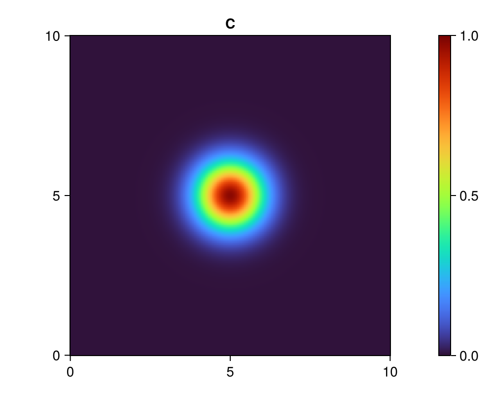

# Diffusion 2D - MPI

In this part, we want to use MPI (distributed parallelism) to parallelize our Diffusion 2D example.

The starting point is (once again) the serial loop version [`diffusion_2d_loop.jl`](./../diffusion_2d/diffusion_2d_loop.jl). The file [`diffusion_2d_mpi.jl`](./diffusion_2d_mpi.jl) in this folder is a modified copy of this variant. While the computational kernel `diffusion_step!` is essentially untouched, we included MPI bits at the beginning of the `run_diffusion` function and introduced the key function `update_halo!`, which is supposed to take care of data exchange between MPI ranks. However, as of now, the function isn't communicating anything and it will be (one of) your tasks to fix that 😉.

## Task 1 - Running the MPI code

Although incomplete from a semantic point of view, the code in `diffusion_2d_mpi.jl` is perfectly runnable as is. It won't compute the right thing, but it runs 😉. So **let's run it**. But how?

First thing to realize is that, on Perlmutter, **you can't run MPI on a login node**. You have two options to work on a compute node:

1) **Interactive session**: You can try to get an interactive session on a compute node by running `sh get_compute_node_interactive.sh`. But unfortunately, we don't have a node for everyone, so you might not get one (Sorry!). **If you can get one**, you can use `mpiexecjl --project -n 4 julia diffusion_2d_mpi.jl` to run the code. Alternatively, you can run `sh job_mpi_singlenode.sh`.

2) **Compute job**: You can always submit a job that runs the code: `sbatch job_mpi_singlenode.sh`. The output will land in `slurm_mpi_singlenode.out`. Check out the [Perlmutter cheetsheet](../../help/perlmutter_cheatsheet.md) to learn more about jobs.

Irrespective of which option you choose, **go ahead an run the code** (with 4 MPI ranks).

To see that the code is currently not working properly (in the sense of computing the right thing), run `julia --project visualize_mpi.jl` to combine the results of different MPI ranks (`*.jld2` files) into a visualization (`visualization.png`). Inspect the visualization and notice the undesired dark lines.

## Task 2 - Halo exchange

Take a look at the general MPI setup (the beginning of `run_diffusion`) and the `update_halo!` function (the bits that are already there) and try to understand it.

Afterwards, implement the necessary MPI communication. To that end, find the "TODO" block in `update_halo!` and follow the instructions. Note that we want to use **non-blocking** communication, i.e. you should use the functions `MPI.Irecv` and `MPI.Isend`.

Check that your code is working by comparing the `visualization.png` that you get to this (basic "eye test"):

## Task 3 - Benchmark

### Part A

Our goal is to perform a rough and basic scaling analysis with 4, 8, and 16 MPI ranks distributed across multiple nodes. Specifically, we want to run 4 MPI ranks on a node and increase the number of nodes to get up to 16 ranks in total.

The file `job_mpi_multinode.sh` is a job script that currently requests a single node (see the line `#SBATCH --nodes=1`) that runs 4 MPI ranks (see the line `#SBATCH --ntasks-per-node=4`), and then runs our Julia MPI code with `do_save=false` for simplicity and `ns=6144`.

Submit this file to SLURM via `sbatch job_mpi_multinode.sh`. Once the job has run, the output will land in `slurm_mpi_multinode.sh`. Write the output down somewhere (copy & paste), change the number of nodes to 2 (= 8 MPI ranks in total) and rerun the experiment. Repeat the same thing, this time requesting 4 nodes (= 16 MPI ranks in total).

### Part B

Inspect the results that you've obtained and compare them.

**Questions**
* What do you observe?
* Is this what you'd expected?

Note that in setting up our MPI ranks, we split our global grid into local grids. In the process, the meaning of the input parameter `ns` changed compared to previous codes (serial & multithreading). It now determines the resolution of the **local grid**  - that each MPI rank is holding - rather than the resolution of the global grid. Since we keep `ns` fixed (6144 in `job_mpi_multinode.sh`), we thus increase the problem size (the total grid resolution) when we increase the number of MPI ranks. This is known as a "weak scaling" analysis.

**Question**

* Given the comment above, what does "ideal parallel scaling" mean in the context of a "weak scaling" analysis?
* What do the observed results tell you?